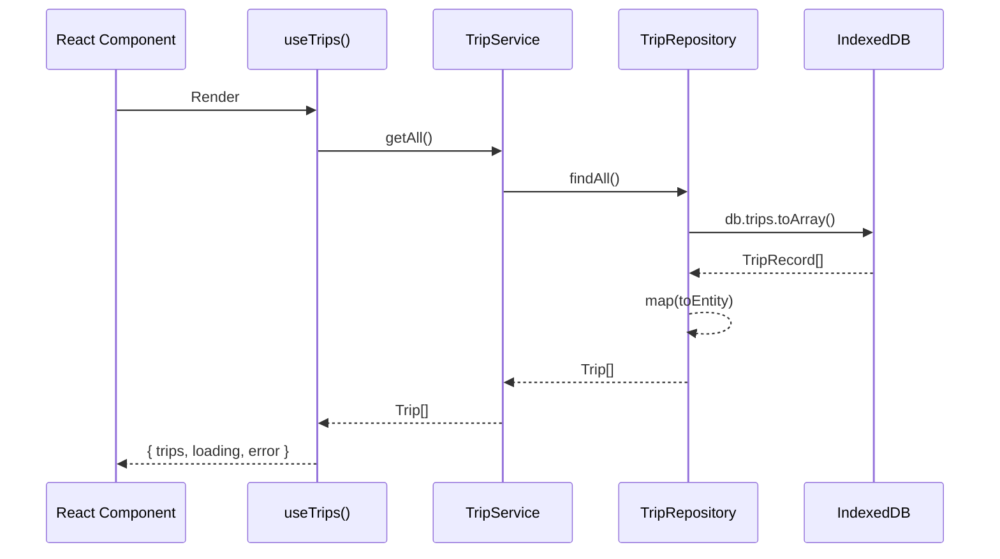
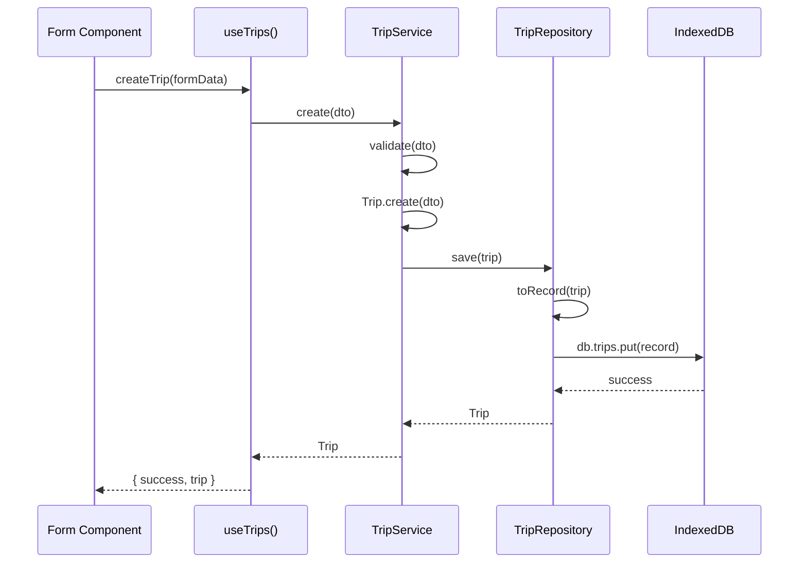
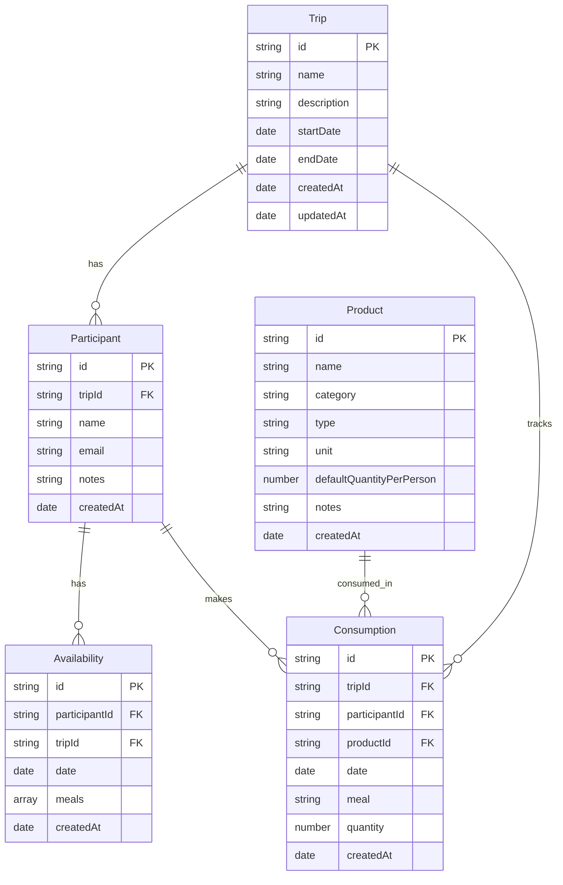

# Documentacion Tecnica - TripFood Manager

## Indice

1. [Arquitectura Hexagonal](#1-arquitectura-hexagonal)
2. [Capas del Sistema](#2-capas-del-sistema)
3. [Patrones de Diseno](#3-patrones-de-diseno)
4. [Flujo de Datos](#4-flujo-de-datos)
5. [Modelo de Datos](#5-modelo-de-datos)
6. [Servicios y Responsabilidades](#6-servicios-y-responsabilidades)
7. [Inyeccion de Dependencias](#7-inyeccion-de-dependencias)
8. [Manejo de Errores](#8-manejo-de-errores)

---

## 1. Arquitectura Hexagonal

TripFood Manager implementa la **Arquitectura Hexagonal** (tambien conocida como Ports & Adapters o Clean Architecture), adaptada para una aplicacion frontend con React.

### 1.1 Diagrama de Arquitectura

```
+------------------------------------------------------------------+
|                        PRESENTATION LAYER                         |
|                         (React + Hooks)                           |
|  +----------+  +----------+  +--------+  +---------+              |
|  |  Pages   |  |Components|  | Hooks  |  | Context |              |
|  +----+-----+  +----+-----+  +---+----+  +----+----+              |
|       |             |            |            |                    |
|       +-------------+------------+------------+                    |
|                          |                                         |
+--------------------------|-----------------------------------------+
                           |
+--------------------------v-----------------------------------------+
|                       APPLICATION LAYER                            |
|                    (Services + Use Cases)                          |
|  +-------------+  +-----------------+  +---------------+           |
|  | TripService |  |ParticipantSvc   |  | ProductService|           |
|  +-------------+  +-----------------+  +---------------+           |
|  +---------------+  +-----------------+  +------------------+      |
|  |ConsumptionSvc |  |AvailabilitySvc  |  | ShoppingService  |      |
|  +---------------+  +-----------------+  +------------------+      |
|                          |                                         |
+--------------------------|-----------------------------------------+
                           |
+--------------------------v-----------------------------------------+
|                        DOMAIN LAYER                                |
|                  (Entities + Business Rules)                       |
|  +------+  +-------------+  +---------+  +-------------+           |
|  | Trip |  | Participant |  | Product |  | Consumption |           |
|  +------+  +-------------+  +---------+  +-------------+           |
|  +------------+  +-------------------+  +------------------+       |
|  |Availability|  | Repository Ifaces |  | Domain Errors    |       |
|  +------------+  +-------------------+  +------------------+       |
|                          |                                         |
+--------------------------|-----------------------------------------+
                           |
+--------------------------v-----------------------------------------+
|                    INFRASTRUCTURE LAYER                            |
|                   (Implementations + External)                     |
|  +-------------------+  +----------------+  +---------------+      |
|  | IndexedDB Repos   |  | Entity Mappers |  | CSV Exporter  |      |
|  +-------------------+  +----------------+  +---------------+      |
|  +-------------------+                                             |
|  | Dexie.js Database |                                             |
|  +-------------------+                                             |
+--------------------------------------------------------------------+
```

### 1.2 Principios Fundamentales

| Principio | Implementacion |
|-----------|----------------|
| **Separation of Concerns** | 4 capas claramente separadas con responsabilidades definidas |
| **Dependency Inversion** | Capas superiores dependen de interfaces, no implementaciones |
| **Single Responsibility** | Cada servicio/componente tiene una unica razon de cambio |
| **Open/Closed** | Extensible via nuevos adaptadores sin modificar el nucleo |
| **Interface Segregation** | Interfaces pequenas y especificas por dominio |

### 1.3 Regla de Dependencia

```
Presentation --> Application --> Domain <-- Infrastructure
```

- **Domain** no depende de ninguna otra capa
- **Application** solo depende de Domain
- **Infrastructure** implementa interfaces de Domain
- **Presentation** usa Application via hooks

---

## 2. Capas del Sistema

### 2.1 Domain Layer (Capa de Dominio)

**Ubicacion:** `src/domain/`

**Responsabilidad:** Contiene la logica de negocio pura, completamente independiente de frameworks o tecnologias externas.

#### Estructura

```
src/domain/
├── entities/           # Entidades de dominio
│   ├── Trip.ts
│   ├── Participant.ts
│   ├── Product.ts
│   ├── Consumption.ts
│   └── Availability.ts
│
├── interfaces/         # Contratos (ports)
│   ├── repositories/
│   │   ├── IBaseRepository.ts
│   │   ├── ITripRepository.ts
│   │   ├── IParticipantRepository.ts
│   │   ├── IProductRepository.ts
│   │   ├── IConsumptionRepository.ts
│   │   └── IAvailabilityRepository.ts
│   └── services/
│       └── IExportService.ts
│
├── types/              # Tipos y enums de dominio
│   ├── common.ts       # Tipos basicos (IEntity, IDateRange)
│   ├── meal.ts         # MealType: breakfast, lunch, dinner, snack
│   └── product.ts      # ProductCategory, ProductType, ProductUnit
│
└── errors/             # Errores de dominio
    ├── DomainError.ts
    ├── ValidationError.ts
    ├── NotFoundError.ts
    └── DuplicateError.ts
```

#### Reglas

- **NO** importa de otras capas
- **NO** depende de React, Dexie, o cualquier framework
- Entidades son **inmutables** (updates devuelven nuevas instancias)
- Validaciones de negocio dentro de las entidades
- Usa patron **Factory** para creacion de entidades

---

### 2.2 Application Layer (Capa de Aplicacion)

**Ubicacion:** `src/application/`

**Responsabilidad:** Orquesta los casos de uso, coordina entidades y repositorios.

#### Estructura

```
src/application/
├── services/           # Servicios de aplicacion
│   ├── TripService.ts
│   ├── ParticipantService.ts
│   ├── ProductService.ts
│   ├── ConsumptionService.ts
│   ├── AvailabilityService.ts
│   └── ShoppingService.ts
│
└── dtos/               # Data Transfer Objects
    ├── trip/
    │   ├── CreateTripDTO.ts
    │   ├── UpdateTripDTO.ts
    │   └── TripResponseDTO.ts
    ├── participant/
    │   ├── CreateParticipantDTO.ts
    │   ├── UpdateParticipantDTO.ts
    │   └── ParticipantResponseDTO.ts
    ├── product/
    ├── consumption/
    ├── availability/
    └── shopping/
        └── ShoppingListDTO.ts
```

#### Reglas

- Solo importa de Domain Layer
- **NO** conoce detalles de UI ni de infraestructura
- Recibe repositorios por **inyeccion de dependencias**
- Usa DTOs para entrada/salida con la capa de presentacion
- Maneja transacciones y coordinacion de operaciones

---

### 2.3 Infrastructure Layer (Capa de Infraestructura)

**Ubicacion:** `src/infrastructure/`

**Responsabilidad:** Implementaciones concretas de repositorios y servicios externos.

#### Estructura

```
src/infrastructure/
├── persistence/
│   ├── indexeddb/              # Repositorios con Dexie/IndexedDB
│   │   ├── database.ts         # Configuracion de Dexie
│   │   ├── TripRepository.ts
│   │   ├── ParticipantRepository.ts
│   │   ├── ProductRepository.ts
│   │   ├── ConsumptionRepository.ts
│   │   └── AvailabilityRepository.ts
│   │
│   └── mappers/                # Conversion Entity <-> Record
│       ├── TripMapper.ts
│       ├── ParticipantMapper.ts
│       ├── ProductMapper.ts
│       ├── ConsumptionMapper.ts
│       └── AvailabilityMapper.ts
│
├── export/                     # Exportadores de datos
│   └── CSVExporter.ts
│
└── errors/                     # Errores de infraestructura
    ├── InfrastructureError.ts
    └── DatabaseError.ts
```

#### Reglas

- Implementa interfaces definidas en Domain
- Contiene detalles tecnicos (IndexedDB, formato CSV, etc.)
- Facilmente intercambiable (cambiar IndexedDB por REST API)
- Mapea entre Records (persistencia) y Entities (dominio)

---

### 2.4 Presentation Layer (Capa de Presentacion)

**Ubicacion:** `src/presentation/`

**Responsabilidad:** Interfaz de usuario, componentes React, manejo de estado de UI.

#### Estructura

```
src/presentation/
├── components/
│   ├── common/                 # Componentes reutilizables
│   │   ├── Button/
│   │   ├── Modal/
│   │   ├── Table/
│   │   ├── Card/
│   │   ├── Input/
│   │   ├── Select/
│   │   ├── Loading/
│   │   ├── EmptyState/
│   │   ├── ErrorDisplay/
│   │   └── ConfirmDialog/
│   │
│   └── layout/                 # Componentes de layout
│       ├── Header/
│       ├── Sidebar/
│       └── MainLayout/
│
├── pages/                      # Paginas de la aplicacion
│   ├── HomePage/
│   ├── TripsPage/
│   ├── TripDetailPage/
│   ├── ParticipantsPage/
│   ├── ProductsPage/
│   ├── AvailabilityPage/
│   └── ShoppingListPage/
│
├── hooks/                      # Custom hooks
│   ├── useTrips.ts
│   ├── useParticipants.ts
│   ├── useProducts.ts
│   ├── useConsumptions.ts
│   ├── useAvailability.ts
│   ├── useShoppingList.ts
│   ├── useForm.ts
│   └── useModal.ts
│
├── context/                    # React Context providers
│   ├── AppContext.tsx
│   ├── ServiceContext.tsx
│   └── TripContext.tsx
│
├── routes/                     # Configuracion de rutas
│   └── AppRouter.tsx
│
└── styles/                     # Estilos globales
    └── global.css
```

#### Reglas

- Solo logica de presentacion
- Llama a servicios via **hooks** y **context**
- **NO** accede directamente a repositorios
- Componentes "tontos" (solo props, sin logica de negocio)

---

## 3. Patrones de Diseno

### 3.1 Repository Pattern

```typescript
// Interfaz (Domain Layer)
interface ITripRepository {
  findById(id: string): Promise<Trip | null>;
  findAll(): Promise<Trip[]>;
  save(trip: Trip): Promise<Trip>;
  delete(id: string): Promise<void>;
}

// Implementacion (Infrastructure Layer)
class IndexedDBTripRepository implements ITripRepository {
  constructor(
    private readonly db: TripFoodDatabase,
    private readonly factory: (props: ITripProps) => Trip
  ) {}

  async findById(id: string): Promise<Trip | null> {
    const record = await this.db.trips.get(id);
    return record ? this.factory(this.toProps(record)) : null;
  }
}
```

### 3.2 Factory Pattern

```typescript
// Las entidades usan factory methods para creacion
const trip = Trip.create({
  name: 'Viaje a la playa',
  startDate: new Date('2024-07-01'),
  endDate: new Date('2024-07-07'),
});

// Reconstruccion desde persistencia
const tripFromDB = Trip.fromPersistence(savedProps);
```

### 3.3 Service Pattern

```typescript
// Servicios de aplicacion orquestan operaciones
class TripService {
  constructor(
    private readonly tripRepository: ITripRepository,
    private readonly participantRepository?: IParticipantRepository
  ) {}

  async create(dto: CreateTripDTO): Promise<Trip> {
    // Validacion
    this.validateCreateDTO(dto);

    // Crear entidad
    const trip = Trip.create(dto);

    // Persistir
    return this.tripRepository.save(trip);
  }
}
```

### 3.4 DTO Pattern

```typescript
// DTOs para transferencia de datos entre capas
interface CreateTripDTO {
  readonly name: string;
  readonly description?: string;
  readonly startDate: Date;
  readonly endDate: Date;
}

interface TripResponseDTO {
  readonly id: string;
  readonly name: string;
  readonly durationDays: number;  // Valor calculado
  readonly participantCount: number;
}
```

### 3.5 Dependency Injection

```typescript
// Contenedor DI configura todas las dependencias
const database = new TripFoodDatabase();
const tripRepository = new IndexedDBTripRepository(database, tripFactory);
const tripService = new TripService(tripRepository);

// Context provee servicios a componentes
export const services = {
  tripService,
  participantService,
  // ...
};
```

---

## 4. Flujo de Datos

### 4.1 Flujo de Lectura (Query)



### 4.2 Flujo de Escritura (Command)



---

## 5. Modelo de Datos

### 5.1 Entidades de Dominio



### 5.2 Tipos de Dominio

#### MealType
```typescript
type MealType = 'breakfast' | 'lunch' | 'dinner' | 'snack';
```

#### ProductCategory
```typescript
type ProductCategory = 'food' | 'beverage' | 'other';
```

#### ProductType
```typescript
type ProductType =
  // Food
  | 'meat' | 'dairy' | 'vegetables' | 'fruits'
  | 'grains' | 'snacks' | 'condiments' | 'prepared_food'
  // Beverage
  | 'water' | 'soft_drink' | 'alcohol' | 'hot_beverage'
  // Other
  | 'miscellaneous';
```

#### ProductUnit
```typescript
type ProductUnit =
  // Weight
  | 'kg' | 'g' | 'lb' | 'oz'
  // Volume
  | 'l' | 'ml' | 'gal'
  // Count
  | 'unit' | 'pack' | 'box' | 'bottle' | 'can' | 'bag'
  // Portions
  | 'serving' | 'portion' | 'slice' | 'piece';
```

### 5.3 Esquema de IndexedDB

```typescript
class TripFoodDatabase extends Dexie {
  trips!: Table<TripRecord>;
  participants!: Table<ParticipantRecord>;
  products!: Table<ProductRecord>;
  consumptions!: Table<ConsumptionRecord>;
  availabilities!: Table<AvailabilityRecord>;

  constructor() {
    super('tripfood-db');

    this.version(1).stores({
      trips: 'id, name, startDate, endDate, createdAt',
      participants: 'id, tripId, name, createdAt',
      products: 'id, name, category, type, createdAt',
      consumptions: 'id, tripId, participantId, productId, date, meal, [tripId+date], [tripId+participantId]',
      availabilities: 'id, participantId, tripId, date, [tripId+date], [participantId+date]'
    });
  }
}
```

---

## 6. Servicios y Responsabilidades

### 6.1 TripService

| Metodo | Descripcion |
|--------|-------------|
| `create(dto)` | Crea un nuevo viaje |
| `getById(id)` | Obtiene viaje por ID |
| `getAll()` | Lista todos los viajes |
| `update(id, dto)` | Actualiza un viaje |
| `delete(id, force?)` | Elimina viaje (cascade opcional) |
| `searchByName(name)` | Busca viajes por nombre |
| `findTripsByDateRange(start, end)` | Viajes en rango de fechas |

### 6.2 ParticipantService

| Metodo | Descripcion |
|--------|-------------|
| `create(dto)` | Crea participante en un viaje |
| `getByTripId(tripId)` | Lista participantes del viaje |
| `update(id, dto)` | Actualiza participante |
| `delete(id, force?)` | Elimina participante |
| `getParticipantsWithAvailability(tripId)` | Participantes con disponibilidad |

### 6.3 ProductService

| Metodo | Descripcion |
|--------|-------------|
| `create(dto)` | Crea nuevo producto |
| `getAll()` | Lista todos los productos |
| `getByCategory(category)` | Productos por categoria |
| `getByType(type)` | Productos por tipo |
| `update(id, dto)` | Actualiza producto |
| `delete(id, force?)` | Elimina producto |

### 6.4 AvailabilityService

| Metodo | Descripcion |
|--------|-------------|
| `setAvailability(dto)` | Establece disponibilidad |
| `getByParticipant(participantId)` | Disponibilidad de participante |
| `getByTripAndDate(tripId, date)` | Disponibilidad por fecha |
| `bulkSetAvailability(dtos)` | Establece multiple disponibilidad |

### 6.5 ConsumptionService

| Metodo | Descripcion |
|--------|-------------|
| `create(dto)` | Registra consumo |
| `getByTripId(tripId)` | Consumos del viaje |
| `getByParticipant(participantId)` | Consumos de participante |
| `update(id, dto)` | Actualiza consumo |
| `delete(id)` | Elimina consumo |

### 6.6 ShoppingService

| Metodo | Descripcion |
|--------|-------------|
| `generate(tripId, options?)` | Genera lista de compras completa |
| `getShoppingList(tripId)` | Alias de generate |
| `getShoppingListByCategory(tripId)` | Lista agrupada por categoria |
| `exportToCSV(tripId, options?)` | Exporta a formato CSV |
| `exportToJSON(tripId)` | Exporta a formato JSON |
| `getConsumptionVariance(tripId)` | Varianza estimado vs real |
| `getShoppingSuggestions(tripId)` | Sugerencias de compra |

---

## 7. Inyeccion de Dependencias

### 7.1 Contenedor de Servicios

```typescript
// src/shared/di/container.ts

// Base de datos singleton
const database = new TripFoodDatabase();

// Factories para entidades
const tripFactory = (props) => Trip.fromPersistence(props);
const participantFactory = (props) => Participant.fromPersistence(props);
// ...

// Repositorios
const tripRepository = new IndexedDBTripRepository(database, tripFactory);
const participantRepository = new IndexedDBParticipantRepository(database, participantFactory);
// ...

// Servicios (con dependencias inyectadas)
export const tripService = new TripService(tripRepository);
export const participantService = new ParticipantService(
  participantRepository,
  tripRepository
);
export const shoppingService = new ShoppingService(
  consumptionRepository,
  productRepository,
  availabilityRepository
);

// Container para Context
export const services = {
  tripService,
  participantService,
  productService,
  consumptionService,
  availabilityService,
  shoppingService,
};
```

### 7.2 Service Context

```typescript
// src/presentation/context/ServiceContext.tsx

const ServiceContext = createContext<ServiceContainer | null>(null);

export const ServiceProvider: React.FC<{ children: ReactNode }> = ({ children }) => {
  return (
    <ServiceContext.Provider value={services}>
      {children}
    </ServiceContext.Provider>
  );
};

export const useServices = (): ServiceContainer => {
  const context = useContext(ServiceContext);
  if (!context) {
    throw new Error('useServices must be used within ServiceProvider');
  }
  return context;
};
```

### 7.3 Uso en Hooks

```typescript
// src/presentation/hooks/useTrips.ts

export function useTrips() {
  const { tripService } = useServices();
  const [trips, setTrips] = useState<Trip[]>([]);
  const [loading, setLoading] = useState(true);

  useEffect(() => {
    tripService.getAll()
      .then(setTrips)
      .finally(() => setLoading(false));
  }, [tripService]);

  const createTrip = async (dto: CreateTripDTO) => {
    const newTrip = await tripService.create(dto);
    setTrips(prev => [...prev, newTrip]);
    return newTrip;
  };

  return { trips, loading, createTrip };
}
```

---

## 8. Manejo de Errores

### 8.1 Jerarquia de Errores

```
Error
├── DomainError
│   ├── ValidationError
│   ├── NotFoundError
│   └── DuplicateError
└── InfrastructureError
    └── DatabaseError
```

### 8.2 Errores de Dominio

```typescript
// Error base de dominio
class DomainError extends Error {
  constructor(
    message: string,
    public readonly code: DomainErrorCode,
    public readonly details?: Record<string, unknown>
  ) {
    super(message);
    this.name = 'DomainError';
  }
}

// Error de validacion
class ValidationError extends DomainError {
  constructor(
    message: string,
    public readonly field?: string,
    public readonly constraint?: string
  ) {
    super(message, DomainErrorCode.VALIDATION_ERROR);
    this.name = 'ValidationError';
  }

  static required(field: string, entity: string): ValidationError {
    return new ValidationError(
      `${field} is required for ${entity}`,
      field,
      'required'
    );
  }

  static invalidDateRange(startField: string, endField: string): ValidationError {
    return new ValidationError(
      `${startField} must be before ${endField}`,
      startField,
      'dateRange'
    );
  }
}

// Error de entidad no encontrada
class NotFoundError extends DomainError {
  constructor(entity: string, identifier: string) {
    super(
      `${entity} not found`,
      DomainErrorCode.NOT_FOUND_ERROR,
      { entity, identifier }
    );
    this.name = 'NotFoundError';
  }

  static withId(entity: string, id: string): NotFoundError {
    return new NotFoundError(entity, `id: ${id}`);
  }
}
```

### 8.3 Manejo en UI

```typescript
// En hooks
const [error, setError] = useState<Error | null>(null);

const createTrip = async (dto: CreateTripDTO) => {
  try {
    setError(null);
    const trip = await tripService.create(dto);
    return { success: true, trip };
  } catch (err) {
    if (err instanceof ValidationError) {
      // Mostrar error en campo especifico
      return { success: false, fieldError: err.field, message: err.message };
    } else if (err instanceof DuplicateError) {
      // Mostrar toast de duplicado
      return { success: false, message: 'Ya existe un viaje con ese nombre' };
    } else {
      // Error generico
      setError(err as Error);
      return { success: false, message: 'Error inesperado' };
    }
  }
};
```

---

## Apendice: Configuracion del Proyecto

### TypeScript Config (tsconfig.json)

```json
{
  "compilerOptions": {
    "target": "ES2020",
    "lib": ["ES2020", "DOM", "DOM.Iterable"],
    "module": "ESNext",
    "moduleResolution": "bundler",
    "strict": true,
    "noEmit": true,
    "jsx": "react-jsx",
    "paths": {
      "@domain/*": ["./src/domain/*"],
      "@application/*": ["./src/application/*"],
      "@infrastructure/*": ["./src/infrastructure/*"],
      "@presentation/*": ["./src/presentation/*"],
      "@shared/*": ["./src/shared/*"]
    }
  }
}
```

### Vite Config (vite.config.ts)

```typescript
export default defineConfig({
  plugins: [react()],
  base: '/tripfood-manager/',
  resolve: {
    alias: {
      '@domain': path.resolve(__dirname, './src/domain'),
      '@application': path.resolve(__dirname, './src/application'),
      '@infrastructure': path.resolve(__dirname, './src/infrastructure'),
      '@presentation': path.resolve(__dirname, './src/presentation'),
      '@shared': path.resolve(__dirname, './src/shared'),
    },
  },
});
```

---

*Documento tecnico v1.0 - TripFood Manager*
